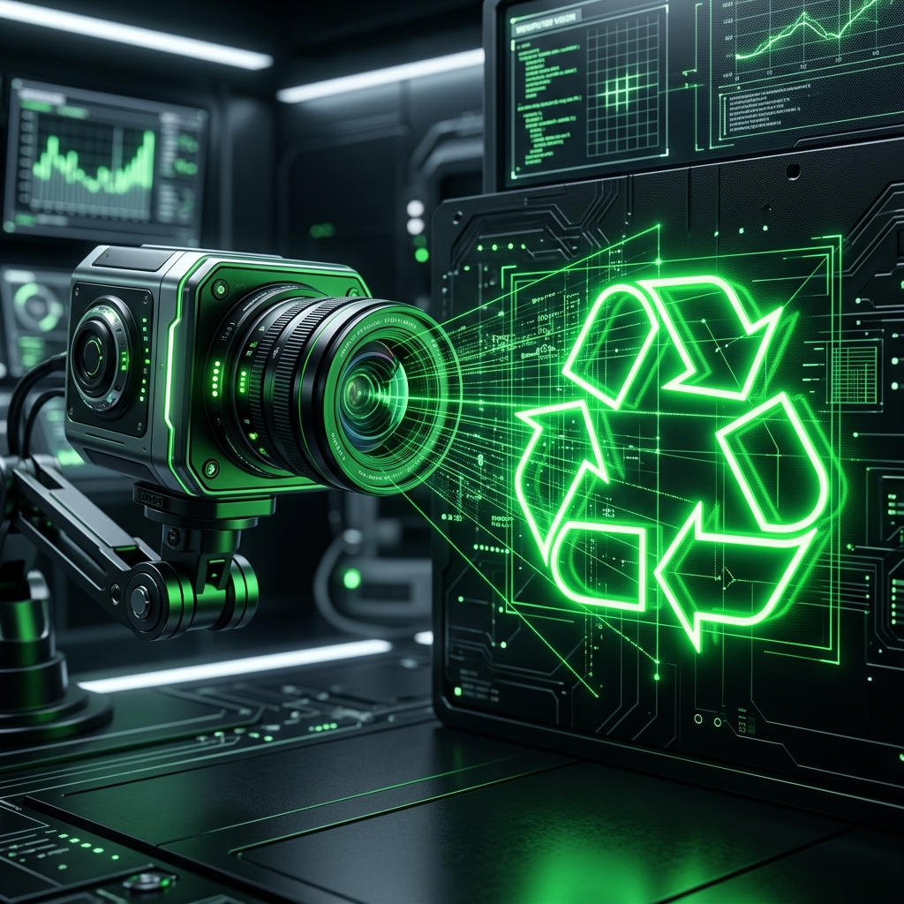

# ♻️ Classificador de Resíduos Recicláveis com Visão Computacional

<div align="center">
  
</div>

Este projeto desenvolve um modelo de visão computacional capaz de identificar o tipo de resíduo (papel, plástico, vidro e metal) a partir de uma imagem. A solução foi criada para auxiliar cooperativas de reciclagem a aumentar produtividade e reduzir erros na triagem manual.

---

## 🎯 Objetivo
Criar um protótipo funcional capaz de:
1. Receber uma imagem enviada pelo usuário.
2. Classificar o tipo de material usando um modelo CNN com transfer learning.
3. Exibir probabilidades por classe.
4. Rodar em CPU com baixo custo computacional.

---

## 💡 Motivação
A triagem manual é lenta e sujeita a erro. Um classificador automático pode ajudar cooperativas a separar materiais de forma mais eficiente, reduzindo desperdício e aumentando valor de venda.

---

## 📁 Dataset
Utilizamos a combinação de três datasets:
1. TrashNet
2. Garbage Classification Dataset
3. Waste Vision Dataset

As classes finais:
- `papel`
- `plastico`
- `vidro`
- `metal`

### 📦 A estrutura dos dados:

| Classe      | Treino | Validação | Total |
|-------------|--------|-----------|-------|
| **Papel**   | 210    | 50        | 260   |
| **Plástico**| 133    | 30        | 163   |
| **Vidro**   | 403    | 100       | 503   |
| **Metal**   | 154    | 40        | 194   |

---

## 🧠 Arquitetura da Solução
1. Organização do dataset em subpastas por classe.
2. Aumentação com rotação leve, variação de brilho e recortes aleatórios.
3. Transfer learning com ResNet18 pré-treinada no ImageNet.
4. Treinamos apenas o classificador final para acelerar o processo.
5. Métrica principal: **F1 macro.**

---

## 🧪 Resultados

### 🔍 Visão geral do melhor modelo

- **Épocas de treino:** 5  
- **Loss de validação (melhor época):** 0.3867  
- **F1 macro (melhor época):** 0.8393  
- **Acurácia de validação:** 86%  
- **Tempo médio de inferência:** ~0.3s em CPU  
- **Modelo salvo em:** `models/model.pth`  
- **Classes treinadas:** `['metal', 'papel', 'plastico', 'vidro']`

O modelo foi treinado com transferência de aprendizado usando ResNet18 e avaliado em um conjunto de validação com 900 imagens.

---

### 📋 Relatório de Classificação (Validação)

| Classe      | Precisão | Recall | F1-score | Suporte |
|------------|----------|--------|----------|---------|
| **Metal**  | 0.75     | 0.85   | 0.80     | 154     |
| **Papel**  | 0.95     | 0.88   | 0.91     | 210     |
| **Plástico** | 0.87   | 0.65   | 0.75     | 133     |
| **Vidro**  | 0.87     | 0.93   | 0.90     | 403     |
| **Média macro** | –   | –      | **0.84** | 900     |

### Principais insights

- O modelo apresenta **bom equilíbrio entre as classes**, com F1 macro em torno de 0.84.  
- **Papel e vidro** são as classes com melhor desempenho, com F1 perto de 0.90.  
- **Metal** tem F1 de 0.80, com bom recall (recupera a maior parte dos metais) e alguma perda de precisão.  
- **Plástico** é a classe mais desafiadora, com recall menor, indicando que parte dos plásticos ainda é confundida com outras classes.  

Esses resultados são adequados para um protótipo de hackathon e indicam espaço claro para evolução com mais dados e ajustes específicos para a classe “plástico”.

---

## ⚙️ Tecnologias Utilizadas
- Python 3.10+
- PyTorch
- Torchvision
- Scikit-learn
- Streamlit
- Pillow
- Numpy

---

## 🚀 Como Rodar

Crie um ambiente virtual e instale as dependências:

```bash
pip install -r requirements.txt
```

Certifique-se de que o dataset está organizado em `data/train` e `data/valid` conforme descrito acima.

Execute o treinamento:

```bash
python train.py
```

Isso irá salvar o modelo treinado em `models/model.pth`.

Em seguida, rode o app:

```bash
streamlit run app.py
```

---

## 📌 Próximos Passos
1. Integrar GradCAM para interpretabilidade.
2. Expandir classes para incluir orgânico e papelão.
3. Testar modelo em câmera de celular para triagem em tempo real.

---

<!-- Início da seção "Contato" -->
<h2>🌐 Contate-me: </h2>
<div>
  <p>Developed by <b>Fábio Nogueira</b></p>
</div>
<p>
<a href="https://www.linkedin.com/in/faanogueira/" target="_blank"></a>
<a href="https://github.com/faanogueira" target="_blank"></a>
<a href="https://api.whatsapp.com/send?phone=5571983937557" target="_blank"></a>
<a href="mailto:faanogueira@gmail.com"></a> 
</p>
<!-- Fim da seção "Contato" -->